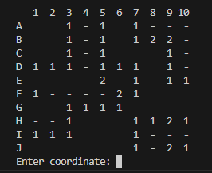

# Minesweeper

===========

## Snippets



## Description

This project is a simplified version of the Minesweeper game, designed to be played in the Java console. The game features a 10x10 grid with 10 randomly placed mines. Players can enter coordinates to check for mines, and the game will provide feedback on the number of surrounding mines or trigger a loss if a mine is selected.

The player can either input a coordinate as (row)(column) e.g. A6, or they can place a flag as !(row)(column) e.g. !F1

### Tech Stack

- Java

## Build Steps

1.  Clone the repository.

```shell
git clone https://github.com/Abbby3/minesweeper
```

2.  Navigate to the project directory.

```shell
cd minesweeper
```

3.  Compile the Java program.

```shell
javac *.java
```

4.  Run the application.

```shell
java Main
```

## Features

- Randomly generate a 10x10 grid with 10 mines.
- Display the grid in the console after each move.
- Allow the user to input coordinates to check for mines or to place flags.
- Cascading reveals for groups of clear spaces.
- Show the number of surrounding mines for each cell.
- Display a game over message and end the game if a mine is selected.
- Win the game by revealing all non-mine squares.

## Future Goals

- Allow the user to configure the number of mines and grid size via a menu at the start of the game.
